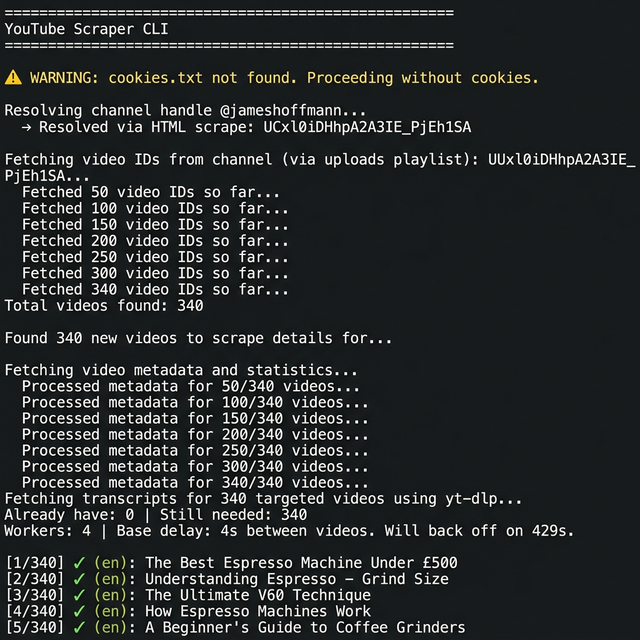
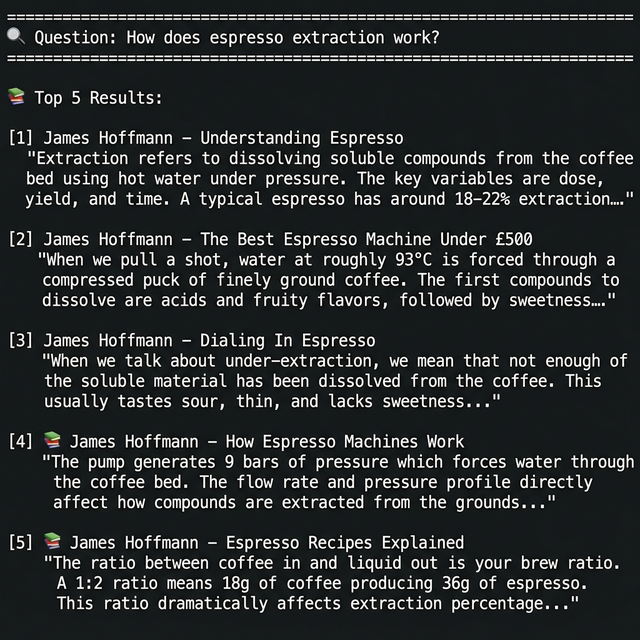
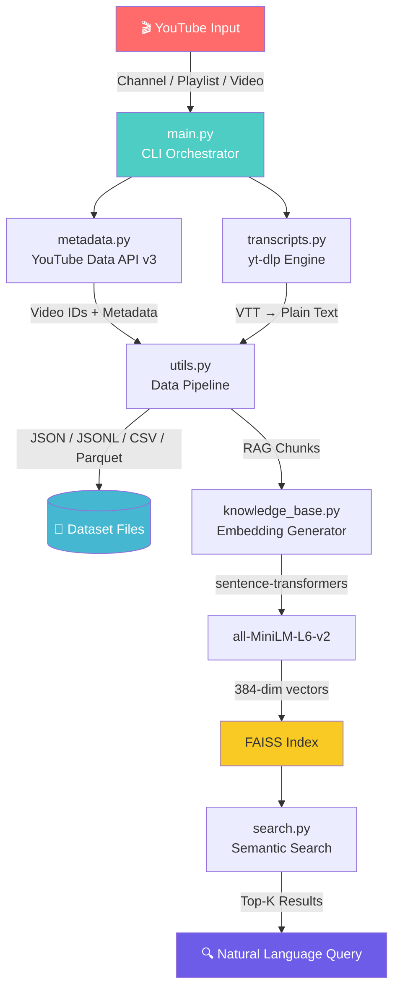
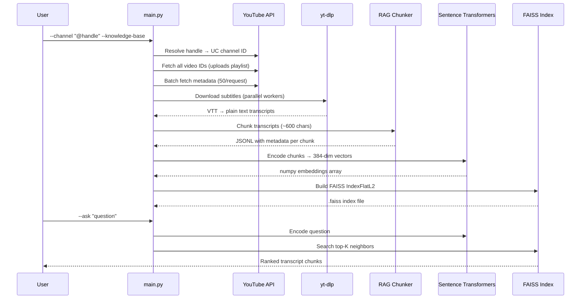

<p align="center">
  <h1 align="center">🧠 YouTube Knowledge Engine</h1>
  <p align="center">
    <strong>End-to-end AI pipeline that transforms YouTube channels into searchable knowledge bases.</strong>
  </p>
  <p align="center">
    <a href="#features"></a>
    
    
    
    
  </p>
</p>

---

## 📌 Overview

**YouTube Knowledge Engine** is a production-grade CLI tool that scrapes YouTube videos at scale, extracts transcripts, and builds AI-ready vector databases — enabling semantic search over any channel's entire content library.

Built as a modular Python package, it handles the full data pipeline from raw YouTube content to queryable knowledge base:

```
YouTube Channel → Metadata + Transcripts → RAG Chunks → Embeddings → FAISS Index → Semantic Search
```

---

## � Demo

### Scraping a YouTube Channel

```bash
python -m youtube_scraper.main --channel "@jameshoffmann" --knowledge-base --workers 4
```

<p align="center">
  
</p>

### Querying the Knowledge Base

```bash
python -m youtube_scraper.main --ask "How does espresso extraction work?"
```

<p align="center">
  
</p>

---

## �🏗️ Architecture



### Module Responsibilities

| Module | Role |
|--------|------|
| `main.py` | CLI interface, workflow orchestration, argument parsing |
| `metadata.py` | YouTube Data API v3 integration, channel handle resolution |
| `transcripts.py` | Parallel transcript extraction via `yt-dlp`, VTT parsing |
| `utils.py` | Multi-format export (JSON/JSONL/CSV/Parquet), RAG chunking, URL cleaning |
| `knowledge_base.py` | Vector embedding generation using `sentence-transformers` + FAISS indexing |
| `search.py` | Semantic search over the FAISS knowledge base |

---

## ✨ Features

| # | Feature | Description |
|---|---------|-------------|
| 1 | **Multi-Source Scraping** | Supports channels, playlists, and individual videos |
| 2 | **Smart URL Cleaning** | Accepts messy URLs, `@handles`, shorts links, and raw IDs |
| 3 | **Parallel Downloads** | Configurable `--workers` for concurrent transcript fetching |
| 4 | **Rate Limit Handling** | Automatic exponential backoff on YouTube 429 errors |
| 5 | **Resume Support** | Interrupted scrapes resume exactly where they left off |
| 6 | **Multi-Format Export** | JSON, JSONL, CSV, and Parquet dataset outputs |
| 7 | **RAG Dataset Generation** | Sentence-boundary-aware chunking for LLM retrieval systems |
| 8 | **Semantic Search** | Natural language queries over video transcripts via FAISS |

---

## 🚀 Quick Start

### Prerequisites

```bash
pip install google-api-python-client yt-dlp
```

For AI features (knowledge base + semantic search):

```bash
pip install sentence-transformers faiss-cpu numpy pandas pyarrow
```

### Set Your API Key

```bash
# Windows (PowerShell)
$env:YOUTUBE_API_KEY="your_key_here"

# Windows (CMD)
set YOUTUBE_API_KEY=your_key_here

# macOS / Linux
export YOUTUBE_API_KEY=your_key_here
```

> Get your free API key from the [Google Cloud Console](https://console.cloud.google.com/apis/credentials).

---

## 💻 Usage

### Scrape a Channel

```bash
python -m youtube_scraper.main --channel "@jameshoffmann" --workers 4
```

### Scrape a Playlist

```bash
python -m youtube_scraper.main --playlist PLBsP89CPrMeOpKhXiKyXg8AjiConuTXvI
```

### Scrape a Single Video

```bash
python -m youtube_scraper.main --video https://youtu.be/dQw4w9WgXcQ
```

### Export as CSV or Parquet

```bash
python -m youtube_scraper.main --channel "@mkbhd" --format csv --output mkbhd_dataset.csv
python -m youtube_scraper.main --channel "@mkbhd" --format parquet --output mkbhd_dataset.parquet
```

### Build a Knowledge Base

```bash
python -m youtube_scraper.main --channel "@jameshoffmann" --knowledge-base --output coffee_knowledge.json
```

This generates:

```
coffee_knowledge.json              # Full metadata + transcripts
coffee_knowledge_rag.jsonl         # Chunked RAG dataset
coffee_knowledge_embeddings.npy    # 384-dim sentence embeddings
coffee_knowledge_vector_index.faiss # Searchable FAISS index
```

### Query the Knowledge Base

```bash
python -m youtube_scraper.main --ask "How does espresso extraction work?"
```

**Example Output:**

```
============================================================
🔍 Question:
   How does espresso extraction work?
============================================================

📚 Top 5 Results:

  [1] James Hoffmann – The Ultimate Espresso Guide
      "Extraction refers to dissolving soluble compounds from
       the coffee bed. The key variables are dose, yield, and..."

  [2] James Hoffmann – Dialing In Espresso
      "When we talk about under-extraction, we mean that not
       enough of the soluble material has been dissolved..."
```

---

## 📂 Project Structure

```
youtube_scraper/
├── main.py              # CLI entry point & workflow orchestrator
├── metadata.py          # YouTube API: video IDs, metadata, handle resolution
├── transcripts.py       # yt-dlp transcript download + VTT parsing
├── utils.py             # Export formats, RAG chunking, URL cleaning
├── knowledge_base.py    # Sentence-transformers + FAISS index builder
└── search.py            # Semantic search engine
```

---

## 🧪 Supported Input Formats

The URL cleaner automatically normalizes all of these:

| Input Type | Examples |
|-----------|----------|
| **Video** | `https://youtube.com/watch?v=VIDEO_ID`, `https://youtu.be/VIDEO_ID`, `https://youtube.com/shorts/VIDEO_ID` |
| **Playlist** | `https://youtube.com/playlist?list=PLAYLIST_ID`, `https://youtube.com/watch?v=ID&list=PLAYLIST_ID` |
| **Channel** | `https://youtube.com/channel/UC...`, `https://youtube.com/@handle`, `https://youtube.com/c/name`, `https://youtube.com/user/name` |

---

## ⚙️ CLI Reference

| Argument | Type | Default | Description |
|----------|------|---------|-------------|
| `--video` | `str` | — | YouTube video ID or URL |
| `--playlist` | `str` | — | YouTube playlist ID or URL |
| `--channel` | `str` | — | YouTube channel ID, URL, or @handle |
| `--ask` | `str` | — | Query an existing knowledge base |
| `--output` | `str` | `scraped_transcripts.json` | Output file path |
| `--format` | `str` | `json` | Export format: `json`, `jsonl`, `csv`, `parquet` |
| `--workers` | `int` | `1` | Parallel download threads |
| `--langs` | `str` | `en,en-GB,en-US` | Subtitle language codes |
| `--delay` | `int` | `4` | Delay between downloads (seconds) |
| `--cookies` | `str` | `cookies.txt` | Path to browser cookies file |
| `--rag` | flag | — | Generate RAG-ready JSONL dataset |
| `--knowledge-base` | flag | — | Build FAISS vector index |

---

## 🧠 How the AI Pipeline Works



---

## 📊 Output Schema

### Video Metadata (JSON)

```json
{
  "id": "dQw4w9WgXcQ",
  "title": "Video Title",
  "description": "...",
  "published_at": "2023-01-01T00:00:00Z",
  "channel_title": "Channel Name",
  "tags": ["tag1", "tag2"],
  "thumbnail_url": "https://i.ytimg.com/vi/.../hqdefault.jpg",
  "duration": "PT10M30S",
  "view_count": 1000000,
  "like_count": 50000,
  "comment_count": 2000,
  "url": "https://www.youtube.com/watch?v=dQw4w9WgXcQ",
  "transcript": "Full transcript text...",
  "transcript_language": "en",
  "transcript_error": null
}
```

### RAG Chunk (JSONL)

```json
{
  "video_id": "dQw4w9WgXcQ",
  "title": "Video Title",
  "channel": "Channel Name",
  "chunk_id": 3,
  "text": "Extraction refers to dissolving soluble compounds from..."
}
```

---

## 🛡️ Rate Limiting & Resilience

- **Automatic backoff**: Starts at configurable delay, doubles on each `429` response
- **Ceiling cap**: Never exceeds 60s between requests
- **Recovery**: Delay halves after successful requests following rate limits
- **Resume**: Progress saved after every single video — crash-safe
- **Thread safety**: File writes and delay tracking use locks for parallel workers

---

## 📋 Requirements

| Package | Required For | Install |
|---------|-------------|---------|
| `google-api-python-client` | Core (metadata) | `pip install google-api-python-client` |
| `yt-dlp` | Core (transcripts) | `pip install yt-dlp` |
| `sentence-transformers` | Knowledge base | `pip install sentence-transformers` |
| `faiss-cpu` | Knowledge base | `pip install faiss-cpu` |
| `numpy` | Knowledge base | `pip install numpy` |
| `pandas` | Parquet export | `pip install pandas` |
| `pyarrow` | Parquet export | `pip install pyarrow` |

---

## 📄 License

This project is licensed under the MIT License.

---

<p align="center">
  Built with ❤️ as an <strong>AI Engineering Portfolio Project</strong>
</p>
